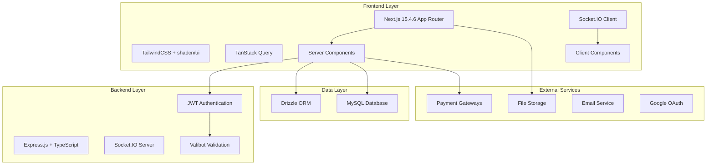

# EduConnect Platform Design Document

## Overview

EduConnect is a full-stack educational platform built with modern web technologies. The architecture follows a separation of concerns pattern with a TypeScript-based Express.js backend, Next.js frontend, and MySQL database. The system supports real-time communication, payment processing, file uploads, and comprehensive content management.

## Architecture

### High-Level Architecture



### Backend Architecture Pattern

The backend follows a layered architecture:

- **Routes Layer**: HTTP endpoint definitions
- **Controller Layer**: Request/response handling and validation
- **Service Layer**: Business logic implementation
- **Repository Layer**: Data access abstraction
- **Model Layer**: Data structures and validation schemas

### Frontend Architecture Pattern (Next.js 15.4.6 App Router)

The frontend leverages Next.js 15.4.6 App Router for modern React development:

- **App Router Structure**: File-based routing with `app/` directory convention
- **Server Components**: Default server-side rendering for optimal performance and SEO
- **Client Components**: Interactive components marked with 'use client' directive
- **Layouts**: Shared UI components across route segments (`layout.tsx`)
- **Pages**: Route-specific UI components (`page.tsx`)
- **Loading States**: Automatic loading UI with `loading.tsx` files
- **Error Boundaries**: Error handling with `error.tsx` files
- **Route Handlers**: API endpoints within the app directory structure
- **Middleware**: Request/response processing and authentication (`middleware.ts`)
- **Partial Prerendering**: Hybrid static/dynamic rendering for optimal performance
- **Server Actions**: Direct server-side functions callable from client components
- **Streaming**: Progressive page rendering with React Suspense

## Components and Interfaces

### Core Modules

#### 1. Authentication Module

- **JWT Service**: Token generation, validation, and refresh
- **OAuth Integration**: Google authentication flow
- **Role-based Access Control**: User, Admin, Instructor permissions with granular permissions
- **Session Management**: Token storage and expiration handling
- **Guest Access Controller**: Public content access without authentication

**Design Rationale**: Supports both authenticated and guest user access patterns as required by Requirement 1, while maintaining security for premium content.

#### 2. User Management Module

- **User Service**: Registration, profile management, role assignment
- **User Repository**: Database operations for user data
- **Profile Controller**: API endpoints for user operations
- **Premium Subscription Service**: Manages premium feature access and billing

**Design Rationale**: Extended to support premium subscriptions for enhanced features like large private rooms and learning analytics (Requirement 8).

#### 3. Forum Module

- **Forum Service**: Thread creation, reply management, real-time updates
- **Forum Repository**: Database operations for forum data
- **Socket.IO Integration**: Real-time message broadcasting
- **File Upload Handler**: Attachment processing for forum posts with markdown support
- **Forum Invitation Service**: Private forum access management and invitation system
- **Forum Access Controller**: Public/private forum access validation

**Design Rationale**: Enhanced with invitation system for private forums and robust access control to support both public and private forum requirements (Requirement 2).

#### 4. Course Module

- **Course Service**: Course creation, enrollment, progress tracking
- **Course Repository**: Database operations for course data
- **Payment Integration**: Course purchase processing with revenue sharing
- **Content Delivery**: Video streaming, PDF serving, quiz management
- **Certificate Service**: Automated certificate generation and delivery
- **Revenue Distribution Service**: 80/20 revenue split calculation and processing

**Design Rationale**: Added certificate generation system and revenue sharing to support instructor monetization and student achievement recognition (Requirements 3, 7).

#### 5. Event Module

- **Event Service**: Event creation, registration, reminder system
- **Event Repository**: Database operations for event data
- **Email Notification Service**: Automated event reminders and confirmations
- **Event Payment Service**: Paid event registration processing
- **Event Capacity Manager**: Registration limits and waitlist management

**Design Rationale**: Enhanced with comprehensive email reminder system and payment processing for paid events (Requirement 4).

#### 6. Chat Module

- **Chat Service**: Personal and group chat management
- **Socket.IO Rooms**: Real-time message delivery
- **Message History**: Chat persistence and retrieval
- **Offline Message Queue**: Message storage and delivery for offline users
- **Chat Notification Service**: Push notifications for missed messages

**Design Rationale**: Added offline message handling to ensure reliable message delivery even when users are not online (Requirement 5).

#### 7. Admin Module

- **Admin Dashboard**: Content management interface
- **Analytics Service**: Usage statistics and reporting with detailed metrics
- **Data Upload Service**: CSV/XLSX/JSON processing with validation
- **Content Moderation**: User and content management tools
- **News Management Service**: Educational news creation and publishing
- **Advertising Management**: Educational ad placement and management system

**Design Rationale**: Expanded with comprehensive data processing capabilities and advertising management to support multiple revenue streams (Requirements 6, 8).

#### 8. Certificate Module

- **Certificate Generator**: PDF certificate creation with templates
- **Certificate Verification**: Digital certificate validation system
- **Certificate Repository**: Storage and retrieval of issued certificates
- **Template Management**: Customizable certificate templates

**Design Rationale**: New module to handle automated certificate generation for course completion and premium features (Requirements 3, 8).

#### 9. Advertising Module

- **Ad Service**: Educational advertisement management
- **Ad Placement Engine**: Strategic ad positioning on pages and forums
- **Ad Analytics**: Performance tracking and reporting
- **Ad Revenue Service**: Advertiser billing and revenue tracking

**Design Rationale**: New module to support educational advertising as a revenue stream while maintaining educational focus (Requirement 8).

### API Design

#### RESTful Endpoints Structure

```
/api/v1/
├── auth/
│   ├── POST /register
│   ├── POST /login
│   ├── POST /refresh
│   ├── POST /logout
│   └── POST /oauth/google
├── users/
│   ├── GET /profile
│   ├── PUT /profile
│   ├── GET /users/:id
│   └── POST /premium/subscribe
├── forums/
│   ├── GET /forums (public access)
│   ├── POST /forums
│   ├── GET /forums/:id/threads
│   ├── POST /forums/:id/threads
│   ├── POST /forums/:id/invite
│   └── PUT /forums/invitations/:id/respond
├── courses/
│   ├── GET /courses (public previews)
│   ├── POST /courses
│   ├── POST /courses/:id/enroll
│   ├── GET /courses/:id/content
│   └── GET /courses/:id/certificate
├── events/
│   ├── GET /events (public access)
│   ├── POST /events
│   ├── POST /events/:id/register
│   └── GET /events/:id/participants
├── chat/
│   ├── GET /conversations
│   ├── POST /conversations
│   ├── GET /conversations/:id/messages
│   └── POST /conversations/:id/messages
├── news/
│   ├── GET /news (public access)
│   ├── POST /news (admin only)
│   ├── PUT /news/:id (admin only)
│   └── DELETE /news/:id (admin only)
├── advertisements/
│   ├── GET /ads/placement/:type
│   ├── POST /ads (admin only)
│   └── GET /ads/analytics (admin only)
└── admin/
    ├── GET /analytics
    ├── POST /data-upload
    ├── GET /users
    ├── PUT /users/:id/status
    └── GET /revenue/reports
```

## Data Models

### Core Database Schema

```sql
-- Users table
CREATE TABLE users (
    id INT PRIMARY KEY AUTO_INCREMENT,
    email VARCHAR(255) UNIQUE NOT NULL,
    password_hash VARCHAR(255),
    full_name VARCHAR(255) NOT NULL,
    role ENUM('student', 'instructor', 'admin') DEFAULT 'student',
    google_id VARCHAR(255),
    avatar_url VARCHAR(500),
    created_at TIMESTAMP DEFAULT CURRENT_TIMESTAMP,
    updated_at TIMESTAMP DEFAULT CURRENT_TIMESTAMP ON UPDATE CURRENT_TIMESTAMP
);

-- Forums table
CREATE TABLE forums (
    id INT PRIMARY KEY AUTO_INCREMENT,
    title VARCHAR(255) NOT NULL,
    description TEXT,
    is_private BOOLEAN DEFAULT FALSE,
    created_by INT,
    created_at TIMESTAMP DEFAULT CURRENT_TIMESTAMP,
    FOREIGN KEY (created_by) REFERENCES users(id)
);

-- Forum threads table
CREATE TABLE forum_threads (
    id INT PRIMARY KEY AUTO_INCREMENT,
    forum_id INT NOT NULL,
    title VARCHAR(255) NOT NULL,
    content TEXT NOT NULL,
    author_id INT NOT NULL,
    created_at TIMESTAMP DEFAULT CURRENT_TIMESTAMP,
    updated_at TIMESTAMP DEFAULT CURRENT_TIMESTAMP ON UPDATE CURRENT_TIMESTAMP,
    FOREIGN KEY (forum_id) REFERENCES forums(id),
    FOREIGN KEY (author_id) REFERENCES users(id)
);

-- Courses table
CREATE TABLE courses (
    id INT PRIMARY KEY AUTO_INCREMENT,
    title VARCHAR(255) NOT NULL,
    description TEXT,
    instructor_id INT NOT NULL,
    price DECIMAL(10,2) DEFAULT 0.00,
    is_free BOOLEAN DEFAULT TRUE,
    thumbnail_url VARCHAR(500),
    created_at TIMESTAMP DEFAULT CURRENT_TIMESTAMP,
    updated_at TIMESTAMP DEFAULT CURRENT_TIMESTAMP ON UPDATE CURRENT_TIMESTAMP,
    FOREIGN KEY (instructor_id) REFERENCES users(id)
);

-- Course enrollments table
CREATE TABLE course_enrollments (
    id INT PRIMARY KEY AUTO_INCREMENT,
    course_id INT NOT NULL,
    student_id INT NOT NULL,
    enrolled_at TIMESTAMP DEFAULT CURRENT_TIMESTAMP,
    progress DECIMAL(5,2) DEFAULT 0.00,
    completed_at TIMESTAMP NULL,
    FOREIGN KEY (course_id) REFERENCES courses(id),
    FOREIGN KEY (student_id) REFERENCES users(id),
    UNIQUE KEY unique_enrollment (course_id, student_id)
);

-- Events table
CREATE TABLE events (
    id INT PRIMARY KEY AUTO_INCREMENT,
    title VARCHAR(255) NOT NULL,
    description TEXT,
    event_date DATETIME NOT NULL,
    price DECIMAL(10,2) DEFAULT 0.00,
    is_free BOOLEAN DEFAULT TRUE,
    max_participants INT,
    created_by INT NOT NULL,
    created_at TIMESTAMP DEFAULT CURRENT_TIMESTAMP,
    FOREIGN KEY (created_by) REFERENCES users(id)
);

-- Event registrations table
CREATE TABLE event_registrations (
    id INT PRIMARY KEY AUTO_INCREMENT,
    event_id INT NOT NULL,
    user_id INT NOT NULL,
    registered_at TIMESTAMP DEFAULT CURRENT_TIMESTAMP,
    payment_status ENUM('pending', 'completed', 'failed') DEFAULT 'completed',
    FOREIGN KEY (event_id) REFERENCES events(id),
    FOREIGN KEY (user_id) REFERENCES users(id),
    UNIQUE KEY unique_registration (event_id, user_id)
);

-- Transactions table
CREATE TABLE transactions (
    id INT PRIMARY KEY AUTO_INCREMENT,
    user_id INT NOT NULL,
    item_type ENUM('course', 'event') NOT NULL,
    item_id INT NOT NULL,
    amount DECIMAL(10,2) NOT NULL,
    payment_method VARCHAR(50),
    payment_status ENUM('pending', 'completed', 'failed', 'refunded') DEFAULT 'pending',
    transaction_id VARCHAR(255),
    created_at TIMESTAMP DEFAULT CURRENT_TIMESTAMP,
    FOREIGN KEY (user_id) REFERENCES users(id)
);

-- Chat conversations table
CREATE TABLE chat_conversations (
    id INT PRIMARY KEY AUTO_INCREMENT,
    type ENUM('personal', 'group') NOT NULL,
    name VARCHAR(255),
    created_by INT NOT NULL,
    created_at TIMESTAMP DEFAULT CURRENT_TIMESTAMP,
    FOREIGN KEY (created_by) REFERENCES users(id)
);

-- Chat messages table
CREATE TABLE chat_messages (
    id INT PRIMARY KEY AUTO_INCREMENT,
    conversation_id INT NOT NULL,
    sender_id INT NOT NULL,
    message TEXT NOT NULL,
    sent_at TIMESTAMP DEFAULT CURRENT_TIMESTAMP,
    FOREIGN KEY (conversation_id) REFERENCES chat_conversations(id),
    FOREIGN KEY (sender_id) REFERENCES users(id)
);

-- News articles table
CREATE TABLE news_articles (
    id INT PRIMARY KEY AUTO_INCREMENT,
    title VARCHAR(255) NOT NULL,
    content TEXT NOT NULL,
    author_id INT NOT NULL,
    featured_image VARCHAR(500),
    category VARCHAR(100),
    published_at TIMESTAMP DEFAULT CURRENT_TIMESTAMP,
    FOREIGN KEY (author_id) REFERENCES users(id)
);

-- Forum invitations table
CREATE TABLE forum_invitations (
    id INT PRIMARY KEY AUTO_INCREMENT,
    forum_id INT NOT NULL,
    inviter_id INT NOT NULL,
    invitee_id INT NOT NULL,
    status ENUM('pending', 'accepted', 'declined') DEFAULT 'pending',
    invited_at TIMESTAMP DEFAULT CURRENT_TIMESTAMP,
    responded_at TIMESTAMP NULL,
    FOREIGN KEY (forum_id) REFERENCES forums(id),
    FOREIGN KEY (inviter_id) REFERENCES users(id),
    FOREIGN KEY (invitee_id) REFERENCES users(id),
    UNIQUE KEY unique_invitation (forum_id, invitee_id)
);

-- Certificates table
CREATE TABLE certificates (
    id INT PRIMARY KEY AUTO_INCREMENT,
    user_id INT NOT NULL,
    course_id INT NOT NULL,
    certificate_url VARCHAR(500) NOT NULL,
    verification_code VARCHAR(100) UNIQUE NOT NULL,
    issued_at TIMESTAMP DEFAULT CURRENT_TIMESTAMP,
    FOREIGN KEY (user_id) REFERENCES users(id),
    FOREIGN KEY (course_id) REFERENCES courses(id),
    UNIQUE KEY unique_certificate (user_id, course_id)
);

-- Premium subscriptions table
CREATE TABLE premium_subscriptions (
    id INT PRIMARY KEY AUTO_INCREMENT,
    user_id INT NOT NULL,
    plan_type ENUM('basic', 'premium', 'enterprise') NOT NULL,
    status ENUM('active', 'cancelled', 'expired') DEFAULT 'active',
    started_at TIMESTAMP DEFAULT CURRENT_TIMESTAMP,
    expires_at TIMESTAMP NOT NULL,
    FOREIGN KEY (user_id) REFERENCES users(id)
);

-- Advertisements table
CREATE TABLE advertisements (
    id INT PRIMARY KEY AUTO_INCREMENT,
    title VARCHAR(255) NOT NULL,
    content TEXT,
    image_url VARCHAR(500),
    target_url VARCHAR(500) NOT NULL,
    advertiser_name VARCHAR(255) NOT NULL,
    placement_type ENUM('banner', 'sidebar', 'inline') NOT NULL,
    status ENUM('active', 'paused', 'expired') DEFAULT 'active',
    start_date TIMESTAMP DEFAULT CURRENT_TIMESTAMP,
    end_date TIMESTAMP NOT NULL,
    created_at TIMESTAMP DEFAULT CURRENT_TIMESTAMP
);

-- Message queue for offline users
CREATE TABLE message_queue (
    id INT PRIMARY KEY AUTO_INCREMENT,
    recipient_id INT NOT NULL,
    message_type ENUM('chat', 'notification', 'system') NOT NULL,
    message_data JSON NOT NULL,
    delivered BOOLEAN DEFAULT FALSE,
    created_at TIMESTAMP DEFAULT CURRENT_TIMESTAMP,
    delivered_at TIMESTAMP NULL,
    FOREIGN KEY (recipient_id) REFERENCES users(id)
);
```

### TypeScript Interfaces

```typescript
// Core user interface
interface User {
  id: number;
  email: string;
  fullName: string;
  role: 'student' | 'instructor' | 'admin';
  googleId?: string;
  avatarUrl?: string;
  createdAt: Date;
  updatedAt: Date;
}

// Course interface
interface Course {
  id: number;
  title: string;
  description: string;
  instructorId: number;
  price: number;
  isFree: boolean;
  thumbnailUrl?: string;
  createdAt: Date;
  updatedAt: Date;
}

// Event interface
interface Event {
  id: number;
  title: string;
  description: string;
  eventDate: Date;
  price: number;
  isFree: boolean;
  maxParticipants?: number;
  createdBy: number;
  createdAt: Date;
}
```

## Error Handling

### Error Response Structure

```typescript
interface ApiError {
  success: false;
  error: {
    code: string;
    message: string;
    details?: any;
  };
  timestamp: string;
}

interface ApiSuccess<T> {
  success: true;
  data: T;
  timestamp: string;
}
```

### Error Categories

- **Authentication Errors**: Invalid credentials, expired tokens
- **Authorization Errors**: Insufficient permissions
- **Validation Errors**: Invalid input data
- **Business Logic Errors**: Enrollment limits, payment failures
- **System Errors**: Database connection, external service failures

### Error Handling Middleware

- Global error handler for unhandled exceptions
- Validation error formatter for Valibot errors
- JWT error handler for authentication failures
- Rate limiting for API abuse prevention

## Testing Strategy

### Backend Testing

- **Unit Tests**: Service layer business logic using Vitest
- **Integration Tests**: API endpoints with test database
- **Repository Tests**: Database operations with test fixtures
- **Socket.IO Tests**: Real-time functionality testing

### Frontend Testing

- **Component Tests**: React component rendering and interactions
- **Integration Tests**: API integration with mock services
- **E2E Tests**: Critical user flows with Playwright

### Test Data Management

- **Fixtures**: Predefined test data for consistent testing
- **Factories**: Dynamic test data generation
- **Database Seeding**: Test database setup and teardown

### CI/CD Pipeline

- **Pre-commit Hooks**: Lint and format code with Husky
- **Automated Testing**: Run test suites on pull requests
- **Code Coverage**: Maintain minimum coverage thresholds
- **Deployment Testing**: Staging environment validation

## UI/UX Design & Color Psychology

### Color Palette Strategy

Based on color psychology principles, the EduConnect platform uses colors that promote learning, trust, and engagement:

#### Primary Color Palette

```css
:root {
  /* Primary Blue - Trust, Focus, Learning */
  --primary-50: #eff6ff;
  --primary-100: #dbeafe;
  --primary-500: #3b82f6;  /* Main brand color */
  --primary-600: #2563eb;
  --primary-700: #1d4ed8;
  
  /* Secondary Green - Growth, Success, Harmony */
  --secondary-50: #f0fdf4;
  --secondary-100: #dcfce7;
  --secondary-500: #22c55e;  /* Success states */
  --secondary-600: #16a34a;
  
  /* Accent Orange - Energy, Creativity, Engagement */
  --accent-50: #fff7ed;
  --accent-100: #ffedd5;
  --accent-500: #f97316;   /* Call-to-action buttons */
  --accent-600: #ea580c;
}
```

#### Functional Color Palette

```css
:root {
  /* Neutral Grays - Balance, Professionalism */
  --gray-50: #f9fafb;
  --gray-100: #f3f4f6;
  --gray-500: #6b7280;
  --gray-700: #374151;
  --gray-900: #111827;
  
  /* Status Colors */
  --success: #22c55e;      /* Course completion, payments */
  --warning: #f59e0b;      /* Pending states, reminders */
  --error: #ef4444;        /* Errors, failed payments */
  --info: #3b82f6;         /* Information, notifications */
}
```

### Color Psychology Application

#### 1. Learning Environment Colors

- **Primary Blue (#3b82f6)**: Promotes focus and concentration, ideal for course content areas
- **Soft Gray Backgrounds (#f9fafb)**: Reduces eye strain during long reading sessions
- **White Space**: Creates mental clarity and reduces cognitive load

#### 2. Engagement & Action Colors

- **Orange Accent (#f97316)**: Stimulates action for course enrollment and event registration
- **Green Success (#22c55e)**: Provides positive reinforcement for completed tasks
- **Warm Yellow (#fbbf24)**: Highlights important information without being alarming

#### 3. Trust & Security Colors

- **Deep Blue (#1d4ed8)**: Used in authentication and payment areas to convey security
- **Professional Gray (#374151)**: For admin interfaces and formal communications

### Typography & Visual Hierarchy

#### Font Strategy

```css
/* Primary Font - Readability & Modern Feel */
--font-primary: 'Inter', -apple-system, BlinkMacSystemFont, sans-serif;

/* Secondary Font - Headings & Emphasis */
--font-secondary: 'Poppins', sans-serif;

/* Monospace - Code & Technical Content */
--font-mono: 'JetBrains Mono', 'Fira Code', monospace;
```

#### Visual Hierarchy

- **H1 Headings**: Primary blue, large size for main page titles
- **H2-H3 Headings**: Dark gray for section organization
- **Body Text**: Medium gray for optimal readability
- **Links**: Primary blue with hover states
- **Buttons**: Color-coded by function (orange for primary actions, blue for secondary)

### Component Design Principles

#### 1. Cards & Content Containers

- Subtle shadows and rounded corners for modern feel
- White backgrounds with light gray borders
- Proper spacing for visual breathing room

#### 2. Interactive Elements

- **Buttons**: Rounded corners, clear hover states, color-coded by importance
- **Forms**: Clean inputs with focus states using primary blue
- **Navigation**: Consistent color scheme with active state indicators

#### 3. Data Visualization

- **Charts**: Use brand colors consistently
- **Progress Bars**: Green for completion, blue for current progress
- **Status Indicators**: Color-coded for quick recognition

### Responsive Design Considerations

#### Mobile-First Approach

- Touch-friendly button sizes (minimum 44px)
- Simplified color palette for smaller screens
- High contrast ratios for outdoor viewing

#### Accessibility Standards

- WCAG 2.1 AA compliance for color contrast
- Color-blind friendly palette testing
- Alternative indicators beyond color (icons, text)

## Security Considerations

### Authentication & Authorization

- JWT tokens with secure signing and expiration
- Role-based access control for different user types
- OAuth integration with Google for secure authentication
- Password hashing using bcrypt with salt rounds

### Data Protection

- Input validation using Valibot schemas
- SQL injection prevention through Drizzle ORM
- XSS protection with content sanitization
- CORS configuration for frontend-backend communication

### File Upload Security

- File type validation and size limits
- Virus scanning for uploaded files
- Secure file storage with access controls
- Content-Type validation for media files

### Payment Security

- PCI DSS compliance through payment gateway integration
- Secure webhook handling for payment confirmations
- Transaction logging and audit trails
- Refund and chargeback handling procedures

## Email Service Architecture

### Email Notification System

The platform implements a comprehensive email service using Nodemailer for transactional emails and automated reminders.

#### Email Service Components

- **Email Template Engine**: Dynamic email template generation with personalization
- **Email Queue System**: Asynchronous email processing with retry mechanisms
- **Event Reminder Scheduler**: Automated scheduling of event reminder emails
- **Email Delivery Tracking**: Monitoring email delivery status and bounce handling

#### Email Types and Triggers

```typescript
interface EmailNotification {
  type: 'event_reminder' | 'course_completion' | 'forum_invitation' | 'payment_confirmation';
  recipient: string;
  templateData: Record<string, any>;
  scheduledAt?: Date;
  priority: 'high' | 'normal' | 'low';
}
```

#### Event Reminder Schedule

- **7 days before**: Initial event reminder with details
- **24 hours before**: Final reminder with access information
- **1 hour before**: Last-minute reminder for online events
- **Post-event**: Thank you email with resources and feedback request

**Design Rationale**: Comprehensive email reminder system ensures high event attendance and user engagement as required by Requirement 4.

## Revenue Sharing and Payment Distribution

### Revenue Distribution Architecture

The platform implements an automated revenue sharing system for course sales and event registrations.

#### Revenue Sharing Model

- **Course Sales**: 80% to instructor, 20% to platform
- **Event Revenue**: 70% to event organizer, 30% to platform
- **Premium Subscriptions**: 100% to platform
- **Advertising Revenue**: 100% to platform

#### Payment Distribution Components

```typescript
interface RevenueDistribution {
  transactionId: string;
  totalAmount: number;
  platformFee: number;
  instructorEarnings: number;
  payoutStatus: 'pending' | 'processed' | 'failed';
  payoutDate?: Date;
}
```

#### Automated Payout System

- **Weekly Payouts**: Automated instructor payments every Friday
- **Minimum Threshold**: $50 minimum for payout processing
- **Payment Methods**: Bank transfer, PayPal, or digital wallet
- **Tax Reporting**: Automated 1099 generation for US instructors

**Design Rationale**: Transparent and automated revenue sharing builds trust with instructors and ensures timely payments as required by Requirement 7.

## Data Processing and Upload System

### File Processing Architecture

The admin dashboard supports bulk data uploads for efficient content management.

#### Supported File Formats

- **CSV**: Comma-separated values for tabular data
- **XLSX**: Excel spreadsheets with multiple sheets
- **JSON**: Structured data for complex objects
- **XML**: Legacy system data imports

#### Data Processing Pipeline

```typescript
interface DataUploadJob {
  fileId: string;
  fileType: 'csv' | 'xlsx' | 'json' | 'xml';
  processingStatus: 'queued' | 'processing' | 'completed' | 'failed';
  recordsProcessed: number;
  errors: string[];
  validationRules: ValidationSchema;
}
```

#### Data Validation and Transformation

- **Schema Validation**: Valibot schemas for data structure validation
- **Data Sanitization**: XSS and injection prevention
- **Duplicate Detection**: Automatic duplicate record handling
- **Error Reporting**: Detailed error logs with line-by-line feedback

**Design Rationale**: Robust data processing system enables efficient bulk operations for administrators as required by Requirement 6.
