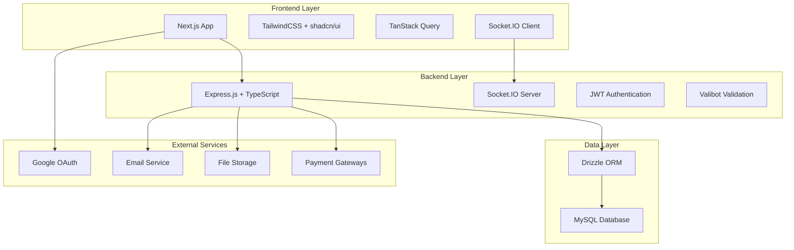

# EduConnect Platform Design Document

## Overview

EduConnect is a full-stack educational platform built with modern web technologies. The architecture follows a separation of concerns pattern with a TypeScript-based Express.js backend, Next.js frontend, and MySQL database. The system supports real-time communication, payment processing, file uploads, and comprehensive content management.

## Architecture

### High-Level Architecture



### Backend Architecture Pattern

The backend follows a layered architecture:
- **Routes Layer**: HTTP endpoint definitions
- **Controller Layer**: Request/response handling and validation
- **Service Layer**: Business logic implementation
- **Repository Layer**: Data access abstraction
- **Model Layer**: Data structures and validation schemas

## Components and Interfaces

### Core Modules

#### 1. Authentication Module
- **JWT Service**: Token generation, validation, and refresh
- **OAuth Integration**: Google authentication flow
- **Role-based Access Control**: User, Admin, Instructor permissions
- **Session Management**: Token storage and expiration handling

#### 2. User Management Module
- **User Service**: Registration, profile management, role assignment
- **User Repository**: Database operations for user data
- **Profile Controller**: API endpoints for user operations

#### 3. Forum Module
- **Forum Service**: Thread creation, reply management, real-time updates
- **Forum Repository**: Database operations for forum data
- **Socket.IO Integration**: Real-time message broadcasting
- **File Upload Handler**: Attachment processing for forum posts

#### 4. Course Module
- **Course Service**: Course creation, enrollment, progress tracking
- **Course Repository**: Database operations for course data
- **Payment Integration**: Course purchase processing
- **Content Delivery**: Video streaming, PDF serving, quiz management

#### 5. Event Module
- **Event Service**: Event creation, registration, reminder system
- **Event Repository**: Database operations for event data
- **Notification Service**: Email reminders and event updates

#### 6. Chat Module
- **Chat Service**: Personal and group chat management
- **Socket.IO Rooms**: Real-time message delivery
- **Message History**: Chat persistence and retrieval

#### 7. Admin Module
- **Admin Dashboard**: Content management interface
- **Analytics Service**: Usage statistics and reporting
- **Data Upload Service**: CSV/XLSX/JSON processing
- **Content Moderation**: User and content management tools

### API Design

#### RESTful Endpoints Structure
```
/api/v1/
├── auth/
│   ├── POST /register
│   ├── POST /login
│   ├── POST /refresh
│   └── POST /logout
├── users/
│   ├── GET /profile
│   ├── PUT /profile
│   └── GET /users/:id
├── forums/
│   ├── GET /forums
│   ├── POST /forums
│   ├── GET /forums/:id/threads
│   └── POST /forums/:id/threads
├── courses/
│   ├── GET /courses
│   ├── POST /courses
│   ├── POST /courses/:id/enroll
│   └── GET /courses/:id/content
├── events/
│   ├── GET /events
│   ├── POST /events
│   └── POST /events/:id/register
├── chat/
│   ├── GET /conversations
│   ├── POST /conversations
│   └── GET /conversations/:id/messages
└── admin/
    ├── GET /analytics
    ├── POST /data-upload
    └── GET /users
```

## Data Models

### Core Database Schema

```sql
-- Users table
CREATE TABLE users (
    id INT PRIMARY KEY AUTO_INCREMENT,
    email VARCHAR(255) UNIQUE NOT NULL,
    password_hash VARCHAR(255),
    full_name VARCHAR(255) NOT NULL,
    role ENUM('student', 'instructor', 'admin') DEFAULT 'student',
    google_id VARCHAR(255),
    avatar_url VARCHAR(500),
    created_at TIMESTAMP DEFAULT CURRENT_TIMESTAMP,
    updated_at TIMESTAMP DEFAULT CURRENT_TIMESTAMP ON UPDATE CURRENT_TIMESTAMP
);

-- Forums table
CREATE TABLE forums (
    id INT PRIMARY KEY AUTO_INCREMENT,
    title VARCHAR(255) NOT NULL,
    description TEXT,
    is_private BOOLEAN DEFAULT FALSE,
    created_by INT,
    created_at TIMESTAMP DEFAULT CURRENT_TIMESTAMP,
    FOREIGN KEY (created_by) REFERENCES users(id)
);

-- Forum threads table
CREATE TABLE forum_threads (
    id INT PRIMARY KEY AUTO_INCREMENT,
    forum_id INT NOT NULL,
    title VARCHAR(255) NOT NULL,
    content TEXT NOT NULL,
    author_id INT NOT NULL,
    created_at TIMESTAMP DEFAULT CURRENT_TIMESTAMP,
    updated_at TIMESTAMP DEFAULT CURRENT_TIMESTAMP ON UPDATE CURRENT_TIMESTAMP,
    FOREIGN KEY (forum_id) REFERENCES forums(id),
    FOREIGN KEY (author_id) REFERENCES users(id)
);

-- Courses table
CREATE TABLE courses (
    id INT PRIMARY KEY AUTO_INCREMENT,
    title VARCHAR(255) NOT NULL,
    description TEXT,
    instructor_id INT NOT NULL,
    price DECIMAL(10,2) DEFAULT 0.00,
    is_free BOOLEAN DEFAULT TRUE,
    thumbnail_url VARCHAR(500),
    created_at TIMESTAMP DEFAULT CURRENT_TIMESTAMP,
    updated_at TIMESTAMP DEFAULT CURRENT_TIMESTAMP ON UPDATE CURRENT_TIMESTAMP,
    FOREIGN KEY (instructor_id) REFERENCES users(id)
);

-- Course enrollments table
CREATE TABLE course_enrollments (
    id INT PRIMARY KEY AUTO_INCREMENT,
    course_id INT NOT NULL,
    student_id INT NOT NULL,
    enrolled_at TIMESTAMP DEFAULT CURRENT_TIMESTAMP,
    progress DECIMAL(5,2) DEFAULT 0.00,
    completed_at TIMESTAMP NULL,
    FOREIGN KEY (course_id) REFERENCES courses(id),
    FOREIGN KEY (student_id) REFERENCES users(id),
    UNIQUE KEY unique_enrollment (course_id, student_id)
);

-- Events table
CREATE TABLE events (
    id INT PRIMARY KEY AUTO_INCREMENT,
    title VARCHAR(255) NOT NULL,
    description TEXT,
    event_date DATETIME NOT NULL,
    price DECIMAL(10,2) DEFAULT 0.00,
    is_free BOOLEAN DEFAULT TRUE,
    max_participants INT,
    created_by INT NOT NULL,
    created_at TIMESTAMP DEFAULT CURRENT_TIMESTAMP,
    FOREIGN KEY (created_by) REFERENCES users(id)
);

-- Event registrations table
CREATE TABLE event_registrations (
    id INT PRIMARY KEY AUTO_INCREMENT,
    event_id INT NOT NULL,
    user_id INT NOT NULL,
    registered_at TIMESTAMP DEFAULT CURRENT_TIMESTAMP,
    payment_status ENUM('pending', 'completed', 'failed') DEFAULT 'completed',
    FOREIGN KEY (event_id) REFERENCES events(id),
    FOREIGN KEY (user_id) REFERENCES users(id),
    UNIQUE KEY unique_registration (event_id, user_id)
);

-- Transactions table
CREATE TABLE transactions (
    id INT PRIMARY KEY AUTO_INCREMENT,
    user_id INT NOT NULL,
    item_type ENUM('course', 'event') NOT NULL,
    item_id INT NOT NULL,
    amount DECIMAL(10,2) NOT NULL,
    payment_method VARCHAR(50),
    payment_status ENUM('pending', 'completed', 'failed', 'refunded') DEFAULT 'pending',
    transaction_id VARCHAR(255),
    created_at TIMESTAMP DEFAULT CURRENT_TIMESTAMP,
    FOREIGN KEY (user_id) REFERENCES users(id)
);

-- Chat conversations table
CREATE TABLE chat_conversations (
    id INT PRIMARY KEY AUTO_INCREMENT,
    type ENUM('personal', 'group') NOT NULL,
    name VARCHAR(255),
    created_by INT NOT NULL,
    created_at TIMESTAMP DEFAULT CURRENT_TIMESTAMP,
    FOREIGN KEY (created_by) REFERENCES users(id)
);

-- Chat messages table
CREATE TABLE chat_messages (
    id INT PRIMARY KEY AUTO_INCREMENT,
    conversation_id INT NOT NULL,
    sender_id INT NOT NULL,
    message TEXT NOT NULL,
    sent_at TIMESTAMP DEFAULT CURRENT_TIMESTAMP,
    FOREIGN KEY (conversation_id) REFERENCES chat_conversations(id),
    FOREIGN KEY (sender_id) REFERENCES users(id)
);

-- News articles table
CREATE TABLE news_articles (
    id INT PRIMARY KEY AUTO_INCREMENT,
    title VARCHAR(255) NOT NULL,
    content TEXT NOT NULL,
    author_id INT NOT NULL,
    featured_image VARCHAR(500),
    category VARCHAR(100),
    published_at TIMESTAMP DEFAULT CURRENT_TIMESTAMP,
    FOREIGN KEY (author_id) REFERENCES users(id)
);
```

### TypeScript Interfaces

```typescript
// Core user interface
interface User {
  id: number;
  email: string;
  fullName: string;
  role: 'student' | 'instructor' | 'admin';
  googleId?: string;
  avatarUrl?: string;
  createdAt: Date;
  updatedAt: Date;
}

// Course interface
interface Course {
  id: number;
  title: string;
  description: string;
  instructorId: number;
  price: number;
  isFree: boolean;
  thumbnailUrl?: string;
  createdAt: Date;
  updatedAt: Date;
}

// Event interface
interface Event {
  id: number;
  title: string;
  description: string;
  eventDate: Date;
  price: number;
  isFree: boolean;
  maxParticipants?: number;
  createdBy: number;
  createdAt: Date;
}
```

## Error Handling

### Error Response Structure
```typescript
interface ApiError {
  success: false;
  error: {
    code: string;
    message: string;
    details?: any;
  };
  timestamp: string;
}

interface ApiSuccess<T> {
  success: true;
  data: T;
  timestamp: string;
}
```

### Error Categories
- **Authentication Errors**: Invalid credentials, expired tokens
- **Authorization Errors**: Insufficient permissions
- **Validation Errors**: Invalid input data
- **Business Logic Errors**: Enrollment limits, payment failures
- **System Errors**: Database connection, external service failures

### Error Handling Middleware
- Global error handler for unhandled exceptions
- Validation error formatter for Valibot errors
- JWT error handler for authentication failures
- Rate limiting for API abuse prevention

## Testing Strategy

### Backend Testing
- **Unit Tests**: Service layer business logic using Vitest
- **Integration Tests**: API endpoints with test database
- **Repository Tests**: Database operations with test fixtures
- **Socket.IO Tests**: Real-time functionality testing

### Frontend Testing
- **Component Tests**: React component rendering and interactions
- **Integration Tests**: API integration with mock services
- **E2E Tests**: Critical user flows with Playwright

### Test Data Management
- **Fixtures**: Predefined test data for consistent testing
- **Factories**: Dynamic test data generation
- **Database Seeding**: Test database setup and teardown

### CI/CD Pipeline
- **Pre-commit Hooks**: Lint and format code with Husky
- **Automated Testing**: Run test suites on pull requests
- **Code Coverage**: Maintain minimum coverage thresholds
- **Deployment Testing**: Staging environment validation

## UI/UX Design & Color Psychology

### Color Palette Strategy

Based on color psychology principles, the EduConnect platform uses colors that promote learning, trust, and engagement:

#### Primary Color Palette
```css
:root {
  /* Primary Blue - Trust, Focus, Learning */
  --primary-50: #eff6ff;
  --primary-100: #dbeafe;
  --primary-500: #3b82f6;  /* Main brand color */
  --primary-600: #2563eb;
  --primary-700: #1d4ed8;
  
  /* Secondary Green - Growth, Success, Harmony */
  --secondary-50: #f0fdf4;
  --secondary-100: #dcfce7;
  --secondary-500: #22c55e;  /* Success states */
  --secondary-600: #16a34a;
  
  /* Accent Orange - Energy, Creativity, Engagement */
  --accent-50: #fff7ed;
  --accent-100: #ffedd5;
  --accent-500: #f97316;   /* Call-to-action buttons */
  --accent-600: #ea580c;
}
```

#### Functional Color Palette
```css
:root {
  /* Neutral Grays - Balance, Professionalism */
  --gray-50: #f9fafb;
  --gray-100: #f3f4f6;
  --gray-500: #6b7280;
  --gray-700: #374151;
  --gray-900: #111827;
  
  /* Status Colors */
  --success: #22c55e;      /* Course completion, payments */
  --warning: #f59e0b;      /* Pending states, reminders */
  --error: #ef4444;        /* Errors, failed payments */
  --info: #3b82f6;         /* Information, notifications */
}
```

### Color Psychology Application

#### 1. Learning Environment Colors
- **Primary Blue (#3b82f6)**: Promotes focus and concentration, ideal for course content areas
- **Soft Gray Backgrounds (#f9fafb)**: Reduces eye strain during long reading sessions
- **White Space**: Creates mental clarity and reduces cognitive load

#### 2. Engagement & Action Colors
- **Orange Accent (#f97316)**: Stimulates action for course enrollment and event registration
- **Green Success (#22c55e)**: Provides positive reinforcement for completed tasks
- **Warm Yellow (#fbbf24)**: Highlights important information without being alarming

#### 3. Trust & Security Colors
- **Deep Blue (#1d4ed8)**: Used in authentication and payment areas to convey security
- **Professional Gray (#374151)**: For admin interfaces and formal communications

### Typography & Visual Hierarchy

#### Font Strategy
```css
/* Primary Font - Readability & Modern Feel */
--font-primary: 'Inter', -apple-system, BlinkMacSystemFont, sans-serif;

/* Secondary Font - Headings & Emphasis */
--font-secondary: 'Poppins', sans-serif;

/* Monospace - Code & Technical Content */
--font-mono: 'JetBrains Mono', 'Fira Code', monospace;
```

#### Visual Hierarchy
- **H1 Headings**: Primary blue, large size for main page titles
- **H2-H3 Headings**: Dark gray for section organization
- **Body Text**: Medium gray for optimal readability
- **Links**: Primary blue with hover states
- **Buttons**: Color-coded by function (orange for primary actions, blue for secondary)

### Component Design Principles

#### 1. Cards & Content Containers
- Subtle shadows and rounded corners for modern feel
- White backgrounds with light gray borders
- Proper spacing for visual breathing room

#### 2. Interactive Elements
- **Buttons**: Rounded corners, clear hover states, color-coded by importance
- **Forms**: Clean inputs with focus states using primary blue
- **Navigation**: Consistent color scheme with active state indicators

#### 3. Data Visualization
- **Charts**: Use brand colors consistently
- **Progress Bars**: Green for completion, blue for current progress
- **Status Indicators**: Color-coded for quick recognition

### Responsive Design Considerations

#### Mobile-First Approach
- Touch-friendly button sizes (minimum 44px)
- Simplified color palette for smaller screens
- High contrast ratios for outdoor viewing

#### Accessibility Standards
- WCAG 2.1 AA compliance for color contrast
- Color-blind friendly palette testing
- Alternative indicators beyond color (icons, text)

## Security Considerations

### Authentication & Authorization
- JWT tokens with secure signing and expiration
- Role-based access control for different user types
- OAuth integration with Google for secure authentication
- Password hashing using bcrypt with salt rounds

### Data Protection
- Input validation using Valibot schemas
- SQL injection prevention through Drizzle ORM
- XSS protection with content sanitization
- CORS configuration for frontend-backend communication

### File Upload Security
- File type validation and size limits
- Virus scanning for uploaded files
- Secure file storage with access controls
- Content-Type validation for media files

### Payment Security
- PCI DSS compliance through payment gateway integration
- Secure webhook handling for payment confirmations
- Transaction logging and audit trails
- Refund and chargeback handling procedures